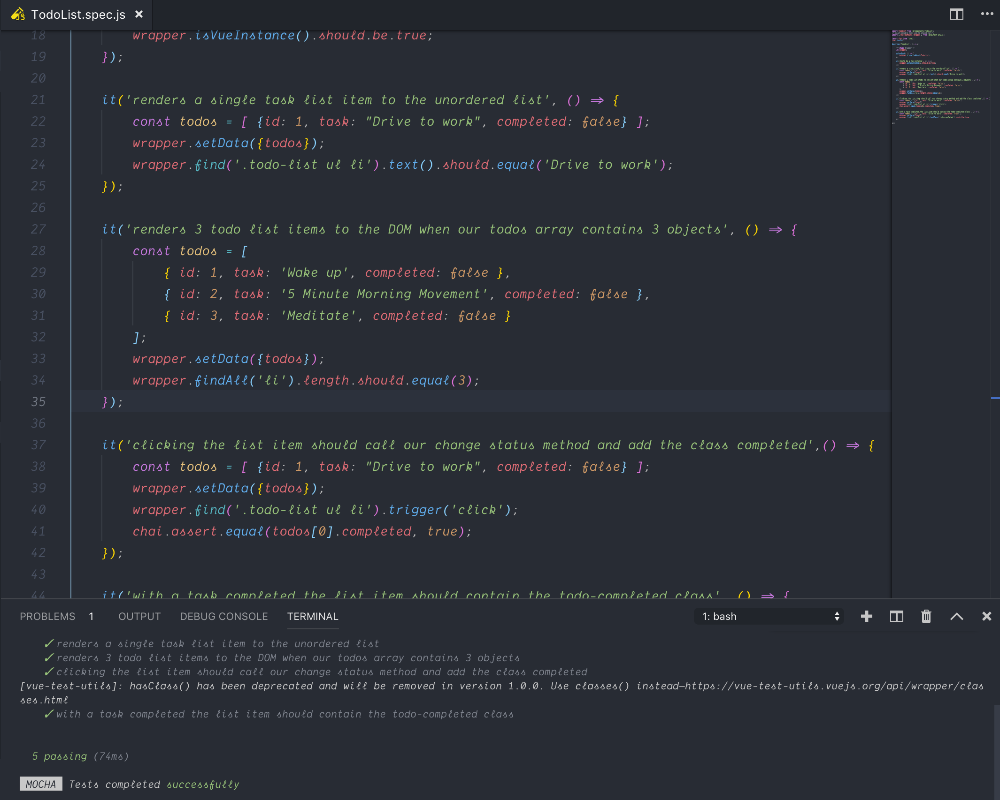

# VueJS Component Testing Tutorial

In this tutorial you are going to take the todo application and add some unit tests to it. The todo application is located in the `todo` folder inside of this directory. 

## Testing setup

You currently only have a single component `TodoList.vue` so you will only need to create one testing specification. Go into tests > unit and create a new file called `TodoList.spec.js`. Remember the convention is to follow the name of your component + .spec + .js. 

You will want to copy the code below and paste it into the file you just created. This was covered in the reading material in the student book so if you are unsure of what is going on here please go back read it again. 

```javascript
import TodoList from '@/components/TodoList';
/* eslint-disable-next-line no-unused-vars */
import { shallowMount, Wrapper } from '@vue/test-utils';

import chai from 'chai';
chai.should();

describe('TodoList', () => {

    /** @type Wrapper */
    let wrapper;

    beforeEach( () => {
        wrapper = shallowMount(TodoList);
    });

    it('should be a Vue instance', () => {
        wrapper.isVueInstance().should.be.true;
    });

});
```

You should be able to run your tests now using the command `npm run test:unit`. If everything went well you should see 1 test passing. 

## Writing your tests

Now that you have the testing spec setup you can begin writing your individual tests. When you write your tests you will want to use a descriptive name so that everyone running your tests know exactly what it is intending to test.

In your first test you want to be sure that when there is a single todo that it is rendered to the DOM. 

```javascript
it('renders a single task list item to the unordered list', () => {

});
```

Now that you have your test you need to setup the data and make your assertion(s). First you will create a todos array with a single object in it and set it to the todos variable in your component using the wrapper. Finally you can find the list items text and make sure it equals the same value that is in your todo object. 

```javascript
it('renders a single task list item to the unordered list', () => {
    const todos = [ {id: 1, task: "Drive to work", completed: false} ];
    wrapper.setData({todos});
    wrapper.find('.todo-list ul li').text().should.equal('Drive to work');
});
```

What if you wanted to setup multiple todos and make sure all of them were rendered to the DOM? 

```javascript
it('renders 3 todo list items to the DOM when our todos array contains 3 objects', () => {
    const todos = [
        { id: 1, task: 'Wake up', completed: false },
        { id: 2, task: '5 Minute Morning Movement', completed: false },
        { id: 3, task: 'Meditate', completed: false }
    ];
    wrapper.setData({todos});
    wrapper.findAll('li').length.should.equal(3);
})
```

So far you have setup some data and checked the DOM for its existence. This is a great start but you need to make sure the functionality in your application is working. In this test you are going to make sure that when a user clicks on the task that it will call the `changeStatus` method and turns the tasks completed property to true.

```javascript
it('clicking the list item should call change status and set completed to true',() => {
    const todos = [ {id: 1, task: "Drive to work", completed: false} ];
    wrapper.setData({todos});
    wrapper.find('.todo-list ul li').trigger('click');
    chai.assert.equal(todos[0].completed, true);
});
```

In the previous test you made sure that the task completed property was changed. In this test you want to test that if a tasks completed property is set to true that the list item has a `todo-completed` class.

``` javascript
it('with a task completed the list item should contain the todo-completed class', () => {
    const todos = [ {id: 1, task: "Drive to work", completed: true} ];
    wrapper.setData({todos});
    wrapper.find('.todo-list ul li').hasClass('todo-completed').should.be.true;
});
```

If everything goes ok you should see 5 passing tests. 


